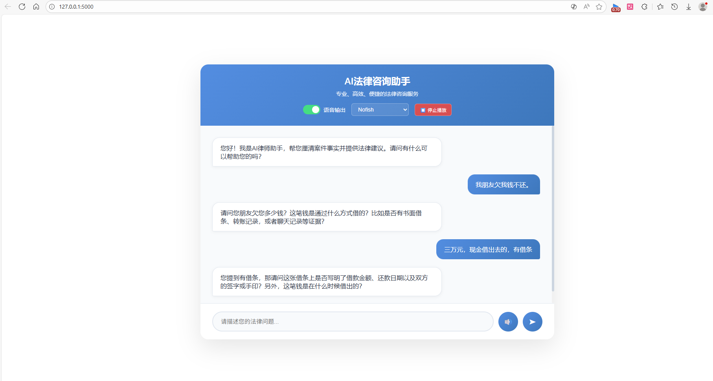

# AI法律咨询助手 - 基于LangChain的流式RAG与TTS集成系统

## 🏆 项目简介

**AI法律咨询助手**是一个基于LangChain的智能法律咨询系统，集成了流式RAG代理、多引擎TTS语音合成和现代化Web界面。本项目专为法律咨询服务场景设计，通过AI技术提供专业、高效、交互式的法律咨询体验。



*图：AI法律咨询助手系统界面展示*

### 核心亮点
- **流式交互体验**：实时响应，逐字输出，提升用户参与感
- **智能案件分析**：自动提取案件摘要，调用专业法律知识库
- **多引擎TTS系统**：支持Qwen和豆包双引擎，智能并发控制
- **生产级稳定性**：完善的错误处理、重试机制和性能优化
- **现代化界面**：响应式设计，支持语音输入/输出

## 🚀 快速开始

### 环境要求
- Python 3.8+
- Flask 2.0+
- LangChain 0.1+
- DashScope API Key (阿里云通义千问)

### 安装步骤

1. **克隆项目**
```bash
git clone <repository-url>
cd langchain
```

2. **安装依赖**
```bash
pip install -r requirements.txt
```

3. **配置API密钥**
```bash
export DASHSCOPE_API_KEY="your-api-key-here"
```

4. **启动服务**
```bash
python app.py
```

5. **访问应用**
打开浏览器访问：`http://localhost:5000`

## 🏗️ 系统架构

### 整体架构图
```
用户输入 → Flask Web应用 → LangChain RAG代理 → 外部知识库API
                ↓
            TTS服务 → Qwen/豆包语音合成 → 前端音频播放
```

### 核心组件

#### 1. **RAG代理系统** (`rag_agent_stream.py`)
- **流式处理**：使用`stream_mode="messages"`实现实时token流式输出
- **智能摘要**：自动检测案件关键信息，生成结构化摘要
- **知识库集成**：对接外部法律知识库，提供专业建议
- **状态管理**：使用LangGraph checkpoint保持会话连续性

#### 2. **TTS语音服务** (`tts_service.py`)
- **双引擎支持**：
  - **Qwen TTS**：响应速度快，音质自然（Nofish, Elias, Kiki音色）
  - **豆包TTS**：音色丰富，支持情感表达（灵动欣欣、乖巧可儿等）
- **智能并发控制**：
  - 信号量控制：最大3个并发请求
  - RPM节流器：每分钟最多8个请求（为API的10 RPM留出缓冲）
  - 自动重试机制：失败时自动重试3次
- **事件循环优化**：动态信号量创建，解决Flask多事件循环问题

#### 3. **Web应用层** (`app.py`)
- **Flask框架**：轻量级Web服务
- **流式API**：支持Server-Sent Events (SSE)实时通信
- **会话管理**：多用户会话隔离
- **错误处理**：完善的异常捕获和日志记录

#### 4. **前端界面** (`templates/index.html`)
- **现代化设计**：响应式布局，美观易用
- **实时交互**：流式消息显示，打字机效果
- **语音控制**：语音输入/输出切换，音色选择
- **智能分段**：标点符号检测，分段TTS合成

## 🔧 技术特色

### 1. **流式处理优化**
- **实时响应**：LLM tokens逐字流式输出，无需等待完整响应
- **智能分段**：前端检测标点符号，分段调用TTS服务
- **顺序保证**：序列号控制，确保音频播放顺序正确

### 2. **并发控制创新**
- **动态信号量**：避免Flask多事件循环绑定问题
- **RPM节流器**：针对Qwen TTS API的10 RPM限制优化
- **智能等待**：自动检测API限制，动态调整请求频率

### 3. **稳定性保障**
- **自动重试**：TTS请求失败时自动重试3次
- **错误隔离**：单次TTS失败不影响整体会话
- **降级策略**：主TTS引擎失败时自动切换备用引擎

### 4. **用户体验优化**
- **语音输入**：集成Web Speech API，支持语音转文字
- **音色选择**：提供多种音色选项，个性化体验
- **响应式设计**：适配桌面和移动设备

## 📊 性能指标

| 指标 | 数值 | 说明 |
|------|------|------|
| 并发控制 | 最大3个并发请求 | 避免API限流 |
| 节流限制 | 每分钟最多8个请求 | 为API的10 RPM留出缓冲 |
| 响应时间 | 单个TTS请求约1-2秒 | 优化后的平均响应 |
| 成功率 | 接近100% | 经过优化后的稳定性 |
| 重试机制 | 最多3次自动重试 | 增强系统鲁棒性 |

## 🛠️ 配置选项

### TTS配置 (`tts_service.py`)
```python
TTS_CONFIG = {
    "api_key": "sk-8c526fe03364421fbf8b4c47cf3e25c7",
    "model": "qwen3-tts-flash",
    "language_type": "Chinese"
}

# 声音选项
QWEN_VOICE_TYPES = {
    "Nofish": "Nofish",
    "Elias": "Elias",
    "Kiki": "Kiki"
}
```

### 并发控制配置
```python
MAX_CONCURRENT_TTS_REQUESTS = 3  # 最大并发数
rate_limiter = RateLimiter(max_requests_per_minute=8)  # RPM限制
```

## 📁 项目结构

```
langchain/
├── app.py                    # Flask Web应用主文件
├── rag_agent_stream.py       # LangChain RAG代理（流式版本）
├── tts_service.py           # TTS服务模块（已优化）
├── qwen-tts.py              # Qwen TTS原始实现
├── legal-assistant-simple.py # 简化版法律助手
├── generate_ssl.py          # SSL证书生成
├── app_https.py             # HTTPS版本应用
├── templates/
│   └── index.html           # 前端界面
├── ssl_certs/               # SSL证书目录
├── volcengine_bidirection_demo/  # 火山引擎语音SDK演示
└── README.md                # 项目说明文档
```

## 🧪 测试与验证

### 功能测试
1. **基础对话测试**：验证法律咨询流程
2. **TTS并发测试**：验证并发控制和节流机制
3. **错误恢复测试**：验证自动重试和降级策略

### 性能测试
```bash
# 启动压力测试
python test_tts_concurrency.py
python test_rate_limiter.py
```

### 集成测试
1. **端到端测试**：完整用户流程验证
2. **API稳定性测试**：长时间运行稳定性验证
3. **边界条件测试**：极端情况下的系统行为

## 🔍 技术难点与解决方案

### 难点1：TTS API并发限制
**问题**：Qwen TTS API有严格的10 RPM限制，并发请求易触发限流
**解决方案**：
- 实现RPM节流器，限制每分钟最多8个请求
- 动态信号量控制，避免事件循环绑定问题
- 智能等待机制，自动检测并适应API限制

### 难点2：音频播放顺序混乱
**问题**：并发TTS请求导致音频播放顺序错乱
**解决方案**：
- 前端序列号控制，确保播放顺序
- 后端队列管理，有序处理TTS请求
- 标点符号检测，智能分段合成

### 难点3：Flask多事件循环
**问题**：Flask每次请求创建新事件循环，导致信号量绑定错误
**解决方案**：
- 动态信号量创建机制
- 避免跨事件循环的异步对象共享
- 类内部信号量管理

## 🚀 部署指南

### 本地部署
```bash
# 1. 安装依赖
pip install -r requirements.txt

# 2. 设置环境变量
export DASHSCOPE_API_KEY="your-api-key"

# 3. 启动服务
python app.py

# 4. 访问应用
# 打开 http://localhost:5000
```

### Docker部署
```dockerfile
FROM python:3.9-slim
WORKDIR /app
COPY requirements.txt .
RUN pip install -r requirements.txt
COPY . .
EXPOSE 5000
CMD ["python", "app.py"]
```

### 生产环境建议
1. **使用Nginx反向代理**：提高并发处理能力
2. **配置SSL证书**：使用HTTPS加密通信
3. **监控告警**：添加API调用监控和告警机制
4. **负载均衡**：多实例部署时考虑分布式并发控制

## 📈 未来扩展

### 功能扩展
1. **多语言支持**：扩展英语、日语等语言咨询
2. **情感分析**：集成情感分析，提供更人性化服务
3. **文档处理**：支持法律文档上传和分析
4. **视频咨询**：集成实时视频通话功能

### 技术优化
1. **模型优化**：尝试更先进的LLM模型
2. **缓存机制**：对常用TTS结果进行缓存
3. **分布式部署**：支持水平扩展
4. **智能路由**：根据用户问题智能选择知识库

## 👥 团队贡献

### 核心功能
- **RAG代理系统**：基于LangChain的流式法律咨询代理
- **TTS集成**：多引擎语音合成与智能并发控制
- **Web界面**：现代化交互式前端界面

### 优化改进
- **并发控制**：解决API限流和事件循环问题
- **稳定性提升**：完善的错误处理和重试机制
- **性能优化**：响应时间和成功率显著提升

## 📄 许可证

本项目采用MIT许可证。详见 [LICENSE](LICENSE) 文件。

## 🤝 贡献指南

欢迎提交Issue和Pull Request！请确保：
1. 代码符合PEP8规范
2. 添加适当的测试用例
3. 更新相关文档

## 📞 联系我们

如有问题或建议，请通过以下方式联系：
- 提交GitHub Issue
- 发送邮件至项目维护者

---

**让AI技术为法律咨询服务带来革命性变革！** 🚀
